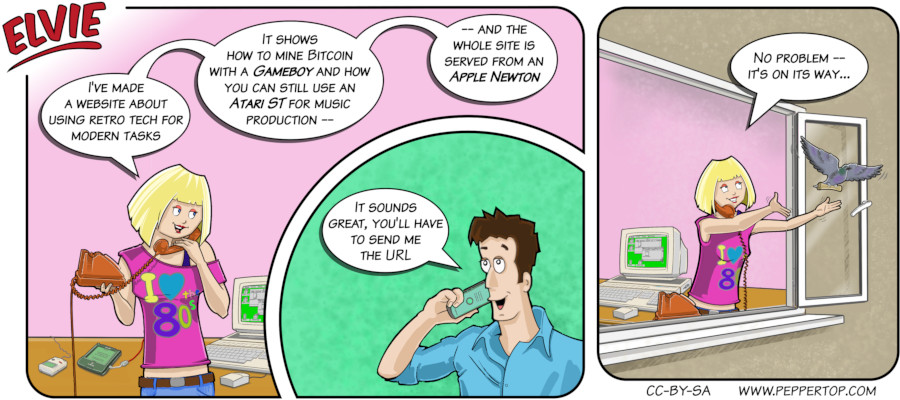

Elvie #106
==========
This strip first appeared in issue #266 of Linux (Pro) Magazine, and takes some heavy inspiration from my own history with computers.
I continues using an Atari ST (and later a Falcon) as my main computing device long after they had ceased production, and I was
also a big fan of the Apple Newton (and yes, there is a web server available for it, and it supports PCMCIA ethernet cards). 

File Details
------------
* 106_panel_n.ora         - The original MyPaint image used for panel _n_ in the strip.
* 106_panel_n.png         - A PNG image, exported from the ORA file the panel _n_ using The GIMP.
* Elvie_106.svg           - The Inkscape SVG file that combines the panel image with frames and text to create the comic.
* Elvie_106_en-GB.jpg     - A PNG export of the final Inkscape file, converted to JPEG format for use on our website (British English).

