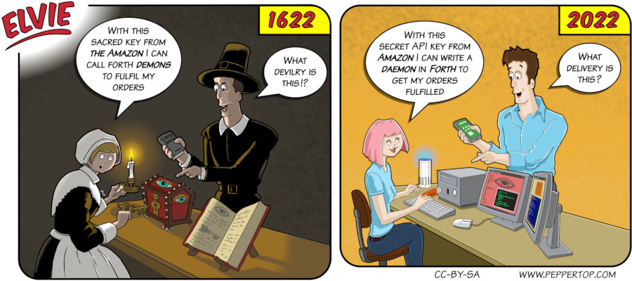

Elvie #108
==========
This strip first appeared in issue #268 of Linux Magazine. I can't deny, this is one of my favourite Elvie strips. It took us a little while to get the right combination of objects mirroring each other between the past and present but, together with the play on words, I think the end result is a clever little strip that's a bit different to most of our others.

File Details
------------
* 108_panel_n.ora         - The original MyPaint image used for panel _n_ in the strip.
* 108_panel_n.png         - A PNG image, exported from the ORA file the panel _n_ using The GIMP.
* Elvie_108.svg           - The Inkscape SVG file that combines the panel image with frames and text to create the comic.
* Elvie_108_en-GB.jpg     - A PNG export of the final Inkscape file, converted to JPEG format for use on our website (British English).

