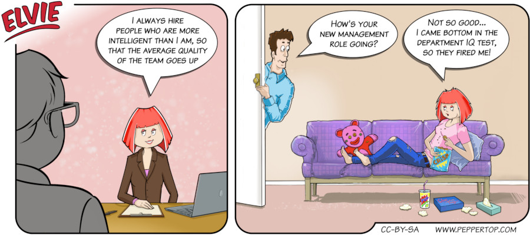

Elvie #113
==========
This strip first appeared in issue #273 of Linux Magazine. This is based on some genuine advice I saw to always hire people more intelligent than you, in order to raise the average level in the company. I wondered what would happen if you took this idea to its logical conclusion.

File Details
------------
* 113_panel_n.ora         - The original MyPaint image used for panel _n_ in the strip.
* 113_panel_n.png         - A PNG image, exported from the ORA file of panel _n_ using The GIMP.
* Elvie_113.svg           - The Inkscape SVG file that combines the panel images with frames and text to create the comic.
* Elvie_113_en-GB.jpg     - A PNG export of the final Inkscape file, converted to JPEG format for use on our website (British English).

