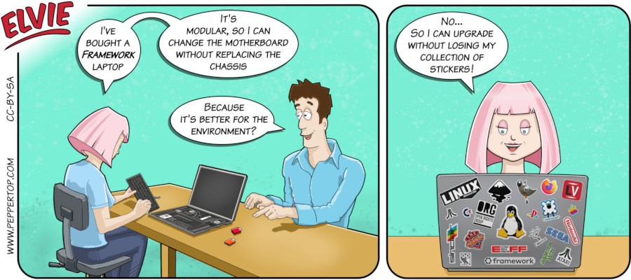

Elvie #135
==========
This strip first appeared in issue #295 of Linux Magazine (June 2025). The Framework company (https://frame.work) was not involved in the creation of this strip in any way - we just thought it made for a good joke. However, we do commend them on the approach they're taking to making modern technology more sustainable.

Particular thanks to the Open Rights Group (www.openrightsgroup.org) and to Llamasoft for providing copies of their logos for us to use. All the logos are copyright of their respective owners, and are included under the 'Parody, caricature and pastiche' provision of UK copyright law.

File Details
------------
* 135_panel_n.ora         - The original MyPaint image used for panel _n_ in the strip.
* 135_panel_n.png         - A PNG image, exported from the ORA file of panel _n_ using The GIMP.
* Elvie_135.svg           - The Inkscape SVG file that combines the panel images with frames and text to create the comic.
* Elvie_135_en-GB.jpg     - A PNG export of the final Inkscape file, converted to JPEG format for use on our website (British English).

